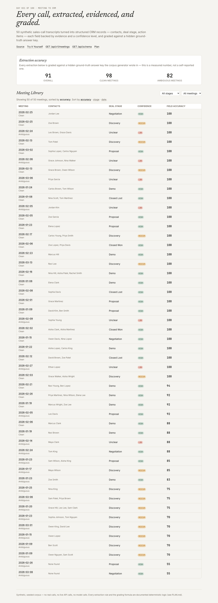
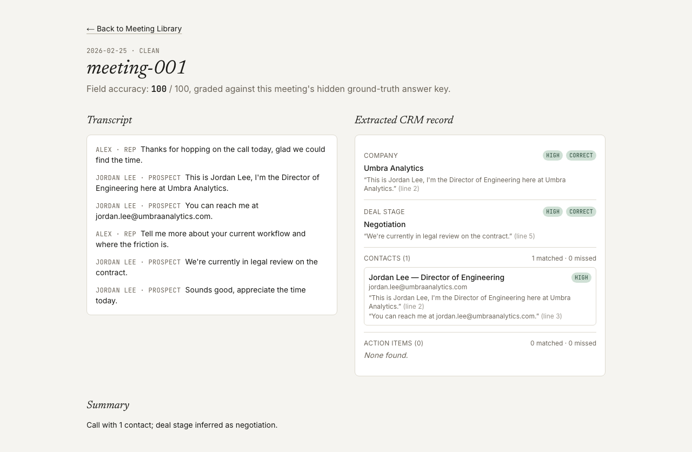
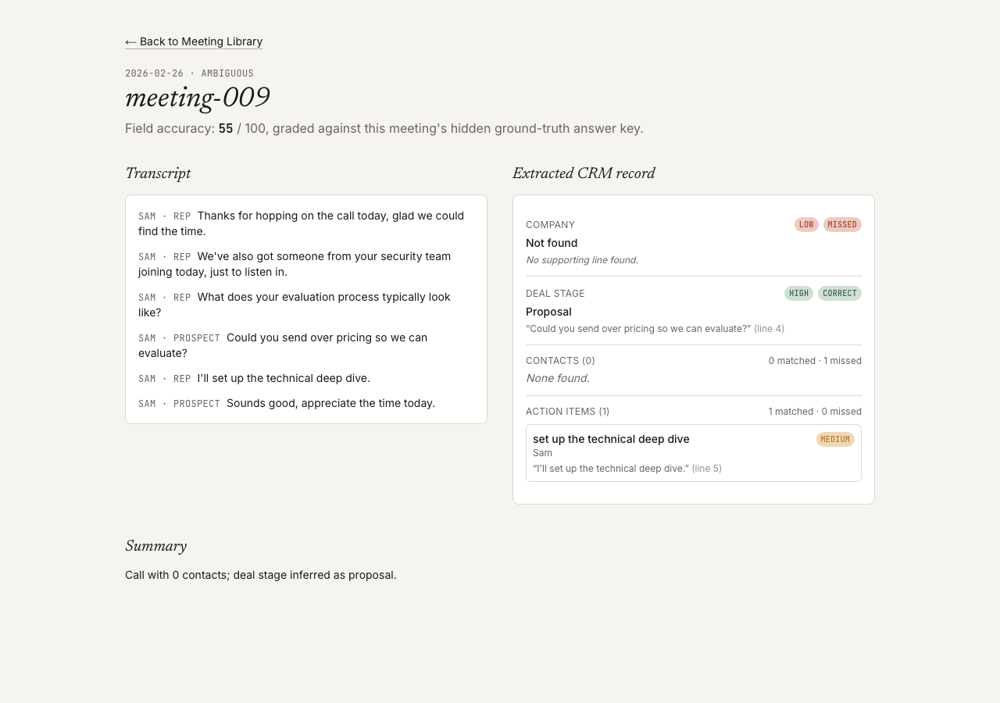
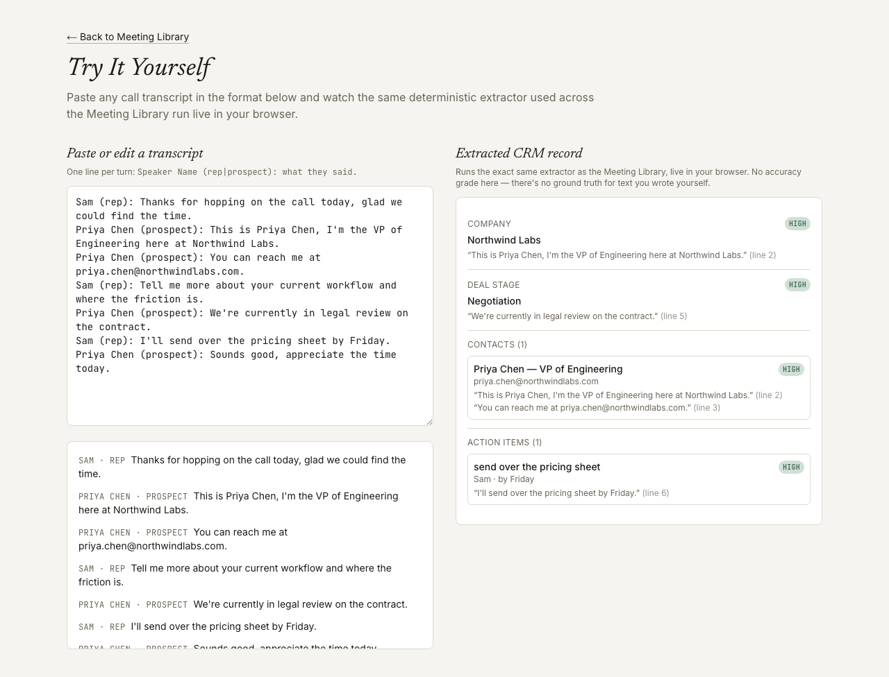

# Meeting to CRM

A workflow that turns sales-call transcripts into structured CRM records —
contacts, deal stage, action items — each field backed by evidence and a
confidence level, and graded against a hidden ground-truth answer key.

**[Live demo](https://meeting-to-crm-coral.vercel.app)** ·
[Plain-English guide](docs/plain-english-guide.md) ·
[`GET /api/v1/meetings`](https://meeting-to-crm-coral.vercel.app/api/v1/meetings) ·
[Plan](./PLAN.md) · Day 021 of a 100-day building challenge



Opens on 50 synthetic call transcripts, each already run through the
extractor and graded against its own answer key. No upload, no sign-up, no
key.

> The corpus is synthetic, seeded, and committed. Each transcript is
> generated with a hidden ground-truth CRM record baked in, and ~40% are
> deliberately ambiguous — a stage discussed in contradictory terms, an
> unnamed contact, a vague action item with no owner. There are **zero
> model calls** anywhere in this repo — extraction is hand-rolled
> regex/keyword pattern matching, not an LLM, and `npm run sweep` checks
> nine invariants in under a second.

## Why I Built This

Every sales call produces information a CRM needs, but getting it from the
call into structured fields is a manual, inconsistent, and often-skipped
step. Three failures show up over and over:

**Extraction is manual and inconsistent.** Reps write notes under time
pressure. Names get misspelled, next steps go unlogged, stage updates lag
the actual conversation by days.

**When extraction is automated, its quality is invisible.** A tool that
says "here's your structured record" without showing *where* each fact came
from is asking for blind trust.

**Extraction accuracy is usually asserted, never measured.** Teams adopt an
"AI reads your calls" tool on the strength of a demo, not a number. Nobody
graded it against calls where the correct answer was already known.

This repo's subject is those three failures: a deterministic extraction
pipeline that shows the evidence and confidence behind every field, and is
graded — automatically, on every run — against a known-correct answer key.

## What It Does

**Five extracted fields per meeting, each with evidence and confidence:**

| field | what it captures | confidence source |
|---|---|---|
| **Contacts** | name, role, email | matched the full introduction pattern, or not found at all |
| **Deal stage** | one of 6 stages, or unclear | exactly one keyword family matched vs. a genuine conflict |
| **Action items** | text, owner, due hint | how many of owner/due-hint resolved |
| **Company** | the account mentioned | stated in an introduction, or not found |
| **Summary** | one templated line | descriptive only, never graded |

Every field is graded against that meeting's own hidden ground truth into a
**field accuracy** score (0–100, weighted 30/15/30/25 across stage / company
/ contacts / action items), aggregated corpus-wide into a measured accuracy
number — not a self-reported one.

**Three screens:** the Meeting Library (sortable/filterable table plus a
corpus accuracy panel split by clean vs. ambiguous), a meeting detail page
(transcript next to the extracted record, every field showing its evidence
and grade), and **Try It Yourself** — paste any transcript and watch the
identical extractor run live in your browser, no server round-trip.

**Zero dependency exceptions.** No NLP library, no LLM — extraction is
hand-rolled regex/keyword matching over the corpus's own transcript format.

## Demo

### Honest failure states, not just the happy path

| A correct extraction | A meeting with real misses |
|---|---|
|  |  |

This meeting scores 55/100: the only contact is never introduced by name
(just "someone from your security team"), so the extractor honestly finds
zero contacts and no company — rather than guessing. The displayed score
matches the documented formula by hand: `0.30×100 (stage correct) + 0.15×0
(company missed) + 0.30×0 (0 of 1 contacts) + 0.25×100 (1 of 1 action
items) = 55`.

### Try It Yourself



Same `extractRecord` function, running client-side. No accuracy grade here
— there's no ground truth for text a visitor typed themselves, and the page
says so rather than pretending otherwise.

## How It Works

```
data/                corpus generation (transcripts + embedded ground truth, seeded RNG) + committed JSON
  ↓
lib/domain/           Meeting, TranscriptLine, ContactFact, ActionItemFact, ExtractedField, MeetingGrade — types + zod
  ↓
lib/extraction/        extractContacts, extractDealStage, extractActionItems, extractCompany, extractRecord
  ↓
lib/grading/            gradeScalarField, gradeListField, gradeRecord
  ↓
lib/meeting-crm/         orchestration — assembles MeetingCrmResult, aggregates CorpusAccuracy
  ↓
app/                      three screens + /api/v1/meetings + /api/schema
```

1. `data/generate.ts` builds 50 synthetic meetings from a fixed seed, each a
   turn-by-turn transcript with a hidden ground-truth CRM record baked in.
   ~40% are flagged `ambiguous`, each carrying exactly one deliberate
   difficulty: conflicting stage language, weak stage phrasing, a vague
   ownerless action item, an unnamed contact, or a missing company mention.
2. `lib/extraction` scans the transcript with documented keyword/pattern
   rules and assigns confidence from the match itself — never from whether
   grading later judged it correct.
3. `lib/grading` compares the extraction to that meeting's ground truth and
   produces a weighted field accuracy score.
4. `lib/meeting-crm` runs every meeting through both and aggregates corpus
   accuracy, split by ambiguity profile.
5. The API and the Meeting Library read the same precomputed result; Try It
   Yourself reuses the identical `extractRecord` client-side.

## Architecture

Six downward-only dependency layers (see the diagram above). `lib/extraction/`
and `lib/grading/` are pure and deterministic — same transcript in,
byte-identical `ExtractedRecord` out, checked by sweep invariant 5 and 9.
Nothing below `app/` imports React, HTTP, or DOM APIs, so `extractRecord` runs
identically in the browser (Try It Yourself) and on the server.

## Key Decisions & Tradeoffs

- **Decision:** Extraction is deterministic regex/keyword matching, not an
  LLM call.
  **Why:** matches the zero-live-dependency convention held by all 20 prior
  days in this series, and keeps every extraction reproducible and free.
  **Tradeoff:** the extractor only generalizes to phrasing patterns it was
  built to recognize — it won't parse an arbitrary real-world transcript as
  well as an LLM would. Try It Yourself makes this limit visible rather than
  hiding it: type something outside the known patterns and watch fields go
  unmatched instead of silently guessed.

- **Decision:** The corpus embeds a hidden ground-truth answer key per
  meeting, and every extraction is graded against it automatically.
  **Why:** turns "transforms into structured info" into a falsifiable,
  measured claim (91 overall, 98 clean vs. 82 ambiguous) instead of an
  unverified vibe.
  **Tradeoff:** grading only exists for the committed corpus — Try It
  Yourself can't self-grade arbitrary pasted text, and the UI says so.

- **Decision:** Confidence is assigned inside extraction, from the match
  itself, and grading never feeds back into it.
  **Why:** a confidence signal derived from its own answer key would be
  circular and worthless. Keeping them separate is what makes the
  calibration invariant (high-confidence fields are actually more often
  correct than low-confidence ones) a real, checked claim.
  **Tradeoff:** confidence can be "wrong" — a high-confidence field can
  still be graded incorrect if the transcript's phrasing was misleadingly
  clean. The corpus's 91% overall accuracy reflects that this is rare, not
  impossible.

## Getting Started

### Prerequisites

Node.js 20+, npm.

### Installation

```bash
git clone https://github.com/akshatiwarix/meeting-to-crm.git
cd meeting-to-crm
npm install
```

### Configuration

None. No environment variables, no API keys — the corpus is committed and
every computation is local.

### Run Locally

```bash
npm run dev
```

Open `http://localhost:3000`.

## Usage

```bash
curl https://meeting-to-crm-coral.vercel.app/api/v1/meetings | jq '.meetings[0] | {id: .meeting.id, stage: .extracted.dealStage.value, accuracy: .grade.fieldAccuracy}'
```

```bash
curl https://meeting-to-crm-coral.vercel.app/api/schema | jq
```

## Validation / Testing

```bash
npm test          # vitest — 58 tests: domain schemas, corpus structure, each
                   # extraction rule, grading formulas, transcript-parser
                   # edge cases, full-pipeline determinism
npm run typecheck  # next typegen && tsc --noEmit
npm run lint       # eslint, flat config
npm run sweep      # scripts/sweep.mts — nine invariants over the committed corpus
```

`npm run sweep` output on the committed corpus:

```
  ok  1. corpus size
  ok  2. ambiguity mix (>=15 of each)
  ok  3. field bounds (confidence enum, fieldAccuracy in [0,100])
  ok  4. evidence traceability
  ok  5. grading reproducibility (recompute matches precomputed)
  ok  6. confidence calibration (high-confidence correctness > low-confidence)
  ok  7. difficulty realism (ambiguous accuracy < clean accuracy)
  ok  8. competence floor (overall field accuracy >= 75)
  ok  9. determinism (corpus generation + full pipeline, byte-identical across two runs)

Headline: overall field accuracy: 91  (clean: 98, ambiguous: 82)
```

Manually verified in-browser on the live deployment: stage and ambiguity
filters narrow the table's row count, all three sort columns reorder rows
correctly, a clean meeting and an ambiguous meeting both render evidence and
grade badges correctly (including a genuine 55/100 miss-heavy case), an
unknown meeting id renders a proper 404, and Try It Yourself re-extracts
live on every edit with no console errors.

## Limitations

- Synthetic corpus — no real calls, no live API calls, no model calls.
- Extraction only recognizes the phrasing patterns it was built for; it is
  not a general-purpose NLU system.
- No CRM write-back — this repo produces a structured record, it doesn't
  save it anywhere.
- Try It Yourself has no accuracy grade — there's no ground truth for
  arbitrary pasted text.

## What I'd Build Next

- Editable extraction — correct a field and see the record update in place.
- A real CRM write-back integration behind a feature flag.
- A confusion-matrix-style breakdown of grading results across the corpus.
- Multi-transcript account rollup, combining several meetings into one
  timeline.
- Swap the synthetic corpus for a real, anonymized, consented transcript
  export.

## License

MIT — see [LICENSE](./LICENSE).
